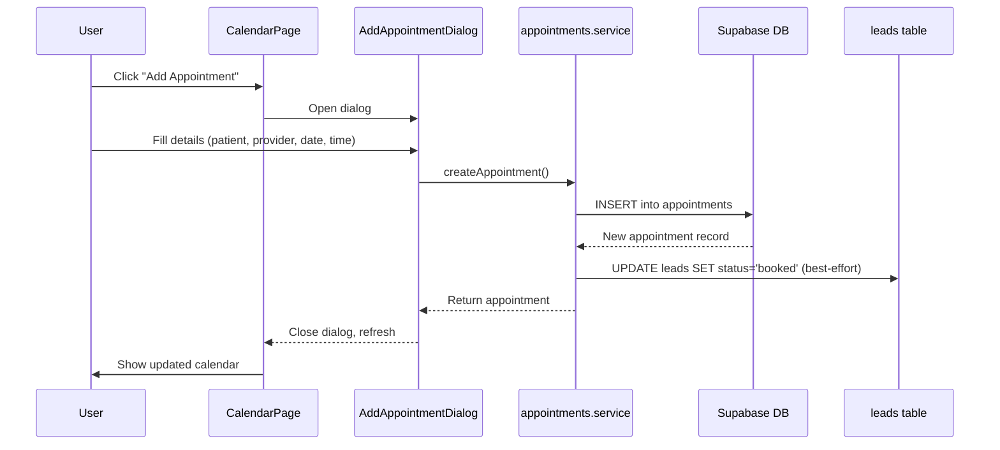
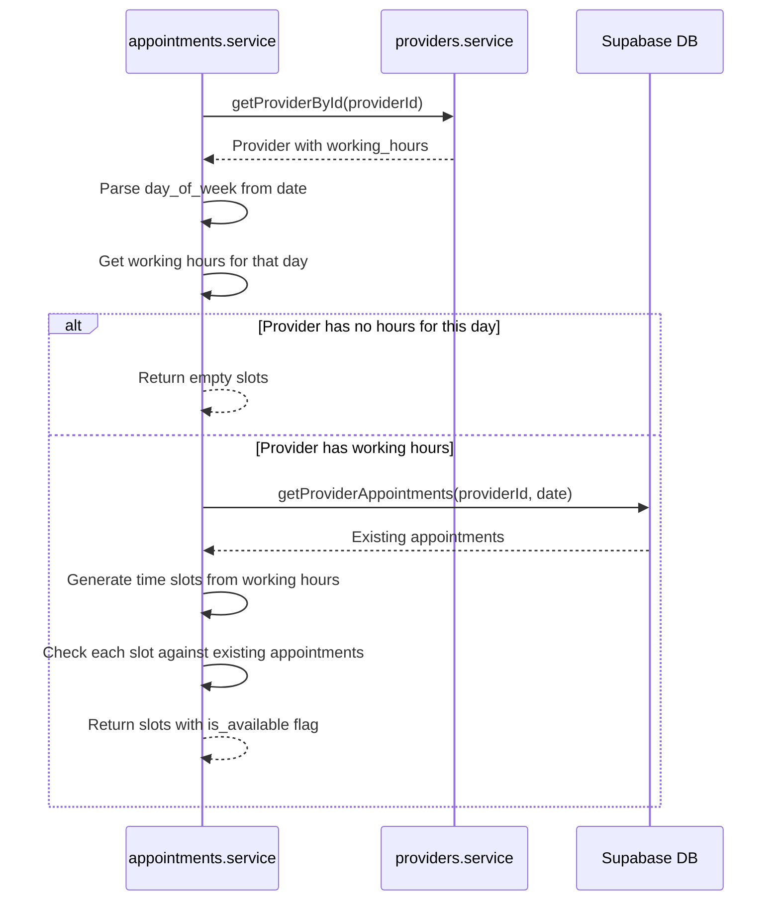
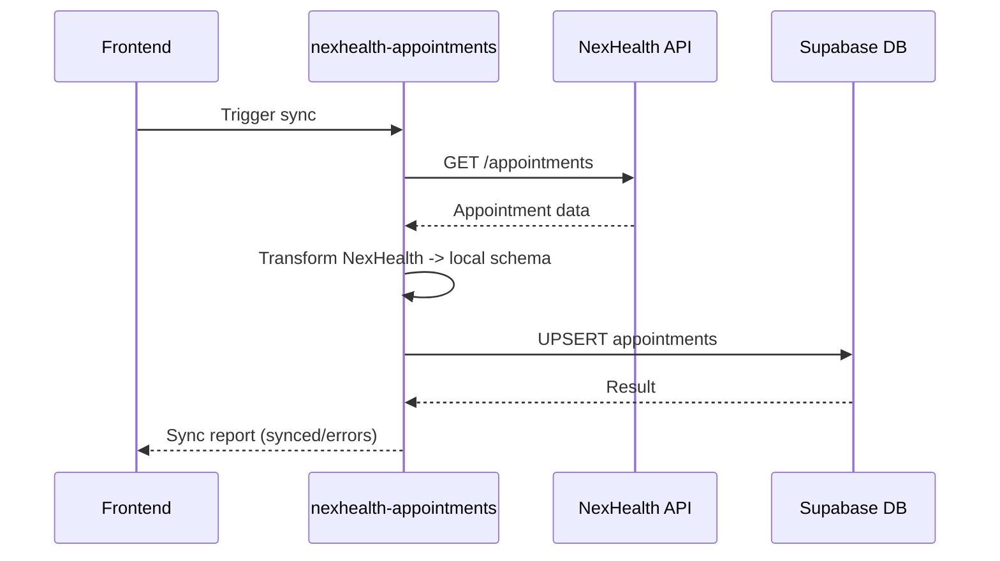

# Appointment Management - Architecture

## System Overview

The Appointment Management module provides a complete scheduling system for healthcare clinics, spanning calendar views, provider availability management, appointment type configuration, and operatory tracking. It integrates with NexHealth for bidirectional appointment and availability syncing.

## Architecture Diagram

```mermaid
graph TB
    subgraph Frontend["Frontend (React)"]
        CP[CalendarPage.tsx]
        AV[Availabilities.tsx]
        AT[AppointmentTypes.tsx]
        OP[Operatories.tsx]

        subgraph Components
            AAD[AddAppointmentDialog]
            RD[RescheduleDialog]
            AATD[AddAppointmentTypeDialog]
            EATD[EditAppointmentTypeDialog]
            AOD[AddOperatoryDialog]
            EOD[EditOperatoryDialog]
        end

        subgraph Hooks
            UA[useAppointments]
            UAV[useAvailabilities]
            UAT[useAppointmentTypes]
        end

        subgraph Services
            AS[appointments.service]
            AVS[availabilities.service]
            ATS[appointment-types.service]
            OS[operatories.service]
        end
    end

    subgraph Supabase["Supabase Backend"]
        DB[(PostgreSQL)]

        subgraph EdgeFunctions["Edge Functions"]
            NEA[nexhealth-appointments]
            NEAV[nexhealth-availabilities]
            NEAT[nexhealth-appointment-types]
            NEO[nexhealth-operatories]
            NES[nexhealth-slots]
        end
    end

    subgraph External["External Services"]
        NH[NexHealth API]
    end

    CP --> UA
    CP --> AAD
    CP --> RD
    AV --> UAV
    AT --> UAT
    OP --> OS

    UA --> AS
    UAV --> AVS
    UAT --> ATS

    AS --> DB
    AVS --> DB
    ATS --> DB
    OS --> DB

    NEA --> NH
    NEAV --> NH
    NEAT --> NH
    NEO --> NH

    NEA --> DB
    NEAV --> DB
    NEAT --> DB
    NEO --> DB
```

## Data Flow

### Appointment Creation Flow

### Slot Availability Check Flow

### NexHealth Sync Flow

## Component Architecture

### Page Components
- **CalendarPage** - Main scheduling interface with day/week/month views using `react-big-calendar`. Supports provider filtering, appointment details modal, rescheduling, and status updates.
- **Availabilities** - Provider weekly schedule management. Create/edit availability blocks per day of week with overrides for specific dates.
- **AppointmentTypes** - CRUD for appointment type definitions including duration, pricing, booking rules, and NexHealth sync.
- **Operatories** - Room/chair management with type classification, institution/location assignment, and NexHealth sync.

### Service Layer Pattern
All database operations go through the service layer (`src/services/`). Services:
1. Accept typed parameters
2. Execute Supabase queries with proper joins
3. Throw errors on failure (caught by hooks/components)
4. Return typed results

### Hook Layer Pattern
React Query hooks (`src/hooks/`) wrap services:
1. `useQuery` for reads with cache keys
2. `useMutation` for writes with cache invalidation
3. Toast notifications on success/error via `useToast`

### Validation Layer
Zod schemas (`src/lib/schemas/appointment.schema.ts`) validate NexHealth data:
- `NexHealthAppointmentCreateSchema`
- `NexHealthAppointmentUpdateSchema`
- `NexHealthAppointmentDataSchema`
- `NexHealthAppointmentTypeSchema`
- `LocalAppointmentSchema`

## State Management

- **Server state**: React Query with keys like `['appointments']`, `['availabilities', providerId]`, `['appointment-types']`
- **Local UI state**: React `useState` for selected date, view mode, filters, dialog visibility
- **Persisted state**: `localStorage` for provider selection (`calendar_provider_selection`)
- **Global state**: Zustand store not directly used; relies on React Query cache

## Key Design Decisions

1. **GiST Exclusion Constraint** - Database-level prevention of double-booking using PostgreSQL GiST index with tsrange overlap detection.
2. **Working Hours on Provider** - Provider working hours stored as JSONB on the `providers` table, separate from the `provider_availabilities` table which handles NexHealth-synced recurring schedules.
3. **Best-effort Lead Updates** - When appointments are created/cancelled, lead status updates are fire-and-forget (non-blocking) to avoid appointment creation failures from lead table issues.
4. **Loose TypeScript** - Uses `as any` casts for tables not in auto-generated types (e.g., `provider_availabilities`, `operatories`), consistent with the project-wide `strict: false` config.
